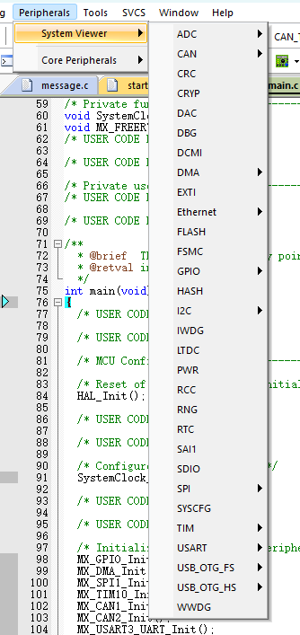

# 2023 COD HAL Template

> 开发工具：Keil5.38、VsCode
> 
> 软件环境：Windows11
> 
> 硬件环境：RoboMaster开发板C型(STM32F407IGHx)
> 
> 调试工具：CMSIS-DAP无线调试器、Jlink-OB
> 

[TOC]

## 基本信息

- **开发方式**

	本模板使用STM32CubeMX生成，使用keil5、VsCode开发，利用ARM Compiler 6(-Os balanced)进行编译.
	
> VsCode推荐插件：Keil Assistant、IntelliCode API Usage Examples、C/C++ Extension Pack

>***强烈建议利用好Keil Debug(Ctrl+F5)，使用Peripherals配合STM32F4XX数据手册，实时便捷地查看外设配置及状态，高效定位问题，为您带来良好的调试体验***

- **层级架构**

	本模板主要分为Algorithm、Application、Bsp、Components、Third_Party五个层级，分别对应算法、应用、中间件、组件和第三方库。开发过程中主要编写组件和应用层，对其余层级的补充欢迎提交pull requests！